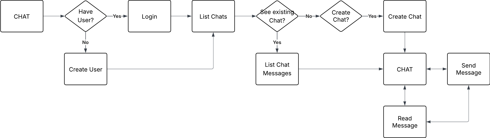
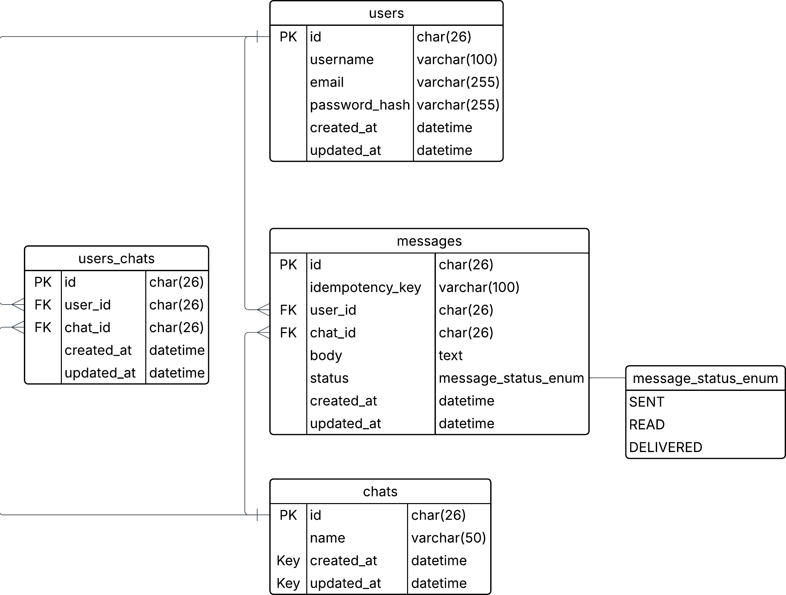

# 🚀 **Real-Time Messaging Application**

A high-performance, real-time messaging system built with Go, gRPC, and Redis. This project demonstrates modern microservices architecture with instant message delivery, JWT authentication, and Redis-based idempotency.

**It was created for [https://github.com/interface-challenge](https://github.com/interface-challenge).**

## 🎯 **What This System Is About**

This is a real-time messaging platform that enables instant communication between users without polling. Built with Go and gRPC, it provides:

- **Real-time messaging** with instant delivery
- **JWT authentication** for secure access
- **Redis idempotency** to prevent duplicate messages
- **gRPC streaming** for efficient real-time communication
- **PostgreSQL** for persistent message storage

## 🔄 **User Flow**



1. **User Registration** → Create account with username, email, and password (returns JWT token)
2. **Authentication** → Login with email and password to get JWT token (alternative to step 1)
3. **Chat Creation** → Create or join chat rooms
4. **Real-Time Messaging** → Send/receive messages instantly
5. **Message Persistence** → All messages stored in database
6. **Idempotency** → Duplicate messages automatically prevented

## 🏗 **Model**



### **Core Components**
- **gRPC Server**: Handles all client communication
- **JWT Service**: Manages authentication and authorization
- **Real-Time Service**: Manages subscriptions and broadcasting
- **Message Service**: Handles message logic and idempotency
- **Redis**: Caching and idempotency management
- **PostgreSQL**: Persistent data storage

### **Key Features**
- **Bidirectional Streaming**: Real-time message delivery
- **Automatic Cleanup**: Subscriptions cleaned up on disconnect
- **Scalable**: Redis enables multi-server deployments
- **Secure**: JWT-based authentication with streaming support

## 🛠 **Main Tools**

- **Go 1.21+**: Core application language
- **gRPC**: High-performance RPC framework
- **Protocol Buffers**: Efficient data serialization
- **Redis**: In-memory caching and idempotency
- **PostgreSQL**: Reliable data persistence
- **Docker**: Containerized development environment
- **Task**: Automated build and development tasks

## 🚀 **Quick Start**

```bash
# 1. Start services
task local-up

# 2. Run the application
task run

# 3. Test real-time messaging
./scripts/test_realtime_working.sh
```

## 📚 **Documentation**

- **[API_USAGE.md](docs/API_USAGE.md)** - API endpoints and usage examples
- **[HOWTORUN.md](docs/HOWTORUN.md)** - How to run the application
- **[HOWTOTEST.md](docs/HOWTOTEST.md)** - How to test the system

## 🧪 **Testing**

```bash
# Run all tests
task test

# Run with coverage
task test-coverage
```

## 🔧 **Development**

```bash
# Install dependencies
task install

# Generate protobuf files
task proto

# Build application
task build

# Clean artifacts
task clean
```

## 📊 **Features Status**

| Feature | Status | Description |
|---------|--------|-------------|
| JWT Authentication | ✅ Complete | Secure token-based auth |
| Real-Time Messaging | ✅ Complete | Instant message delivery |
| Redis Idempotency | ✅ Complete | Duplicate prevention |
| gRPC Streaming | ✅ Complete | Bidirectional communication |
| Message Persistence | ✅ Complete | Database storage |
| User Management | ✅ Complete | Registration and login |
| Chat Management | ✅ Complete | Create and manage chats |

## 🌟 **Key Benefits**

- **No Polling**: Messages arrive instantly
- **Scalable**: Redis enables horizontal scaling
- **Secure**: JWT authentication throughout
- **Efficient**: gRPC for high-performance communication
- **Reliable**: Idempotency prevents message loss
- **Modern**: Built with current best practices

## 📖 **Learn More**

- [Go gRPC Documentation](https://grpc.io/docs/languages/go/)
- [Redis Documentation](https://redis.io/documentation)
- [PostgreSQL Documentation](https://www.postgresql.org/docs/)
- [JWT Introduction](https://jwt.io/introduction)

---

**Built with ❤️ using modern Go practices and real-time technologies.**